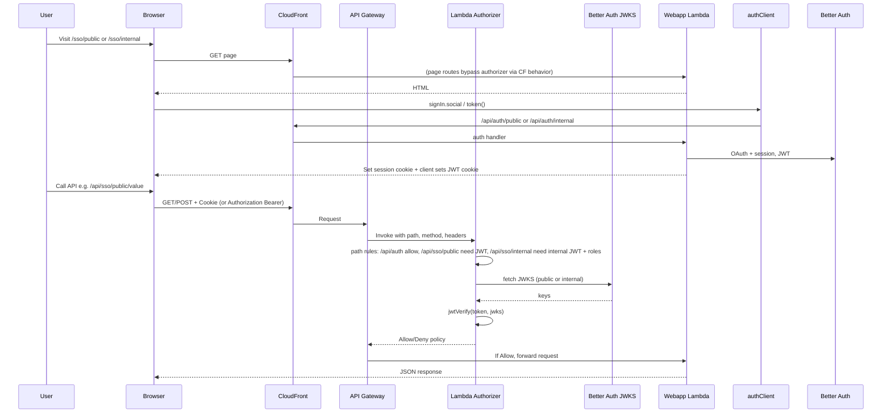

# Authentication and Authorization

This document describes how authentication and authorization are implemented in this application.

## Overview

The app uses **dual SSO**: a **public** flow (GitHub) and an **internal** flow (Microsoft Entra ID). Authentication is handled by [Better Auth](https://www.better-auth.com/), which issues JWTs. API protection is enforced by an **API Gateway Lambda Request Authorizer** that validates those JWTs and applies path- and role-based rules. Tokens are sent to the API via the `Authorization: Bearer` header or via cookies (`__auth_jwt_public` / `__auth_jwt_internal`).

## Architecture diagram

## Authentication

Authentication is implemented with **Better Auth**. There are two separate auth instances:

- **Public** — GitHub only. Base path `/api/auth/public`. Used for the public SSO area (`/sso/public`).
- **Internal** — Microsoft Entra ID only. Base path `/api/auth/internal`. Used for the internal SSO area (`/sso/internal`). User roles from Entra ID are mapped into the session and into the JWT payload.

### Server configuration

- **`src/webapp/lib/auth.ts`** — Defines `authPublic` and `authInternal`:
  - Both use `jwt()` and `tanstackStartCookies()`.
  - Internal adds `customSession` (to expose `roles` in the session) and a `jwt` plugin that includes `roles` in the JWT payload. Entra ID roles are mapped via `mapProfileToUser` (stored as a JSON string on the user).

### Client configuration

- **`src/webapp/lib/auth-client.ts`** — Defines `authClientPublic` and `authClientInternal`:
  - Both use `jwtClient()`.
  - Internal also uses `genericOAuthClient()` and `customSessionClient<typeof authInternal>()`.
  - Each client targets its auth base path (`/api/auth/public` or `/api/auth/internal`).

### Auth API route

- **`src/webapp/routes/api.auth.$.tsx`** — Handles all `/api/auth/*` requests:
  - `/api/auth/public/*` → `authPublic.handler(request)`.
  - `/api/auth/internal/*` → `authInternal.handler(request)`.

### SSO pages and JWT cookies

- **`src/webapp/routes/sso/public.tsx`** — Public SSO page. After sign-in with GitHub, the client calls `authClientPublic.token()` and sets the JWT in a cookie named `__auth_jwt_public` (path `/`, max-age 900 seconds, SameSite=Lax).
- **`src/webapp/routes/sso/internal.tsx`** — Internal SSO page. After sign-in with Entra ID, the client calls `authClientInternal.token()` and sets the JWT in a cookie named `__auth_jwt_internal` (same cookie attributes).

The API Gateway authorizer reads these cookies (or the `Authorization: Bearer` header) to authorize requests. Page routes (`/sso/public`, `/sso/internal`) are served by the webapp and do not go through the authorizer; only API routes that hit API Gateway are protected by it.

### Environment variables (authentication)

| Variable | Purpose |
|----------|---------|
| `BETTER_AUTH_SECRET` | Secret for Better Auth (min 32 characters). |
| `BETTER_AUTH_URL` | Base URL of the app (e.g. CloudFront or localhost). |
| `GITHUB_CLIENT_ID` / `GITHUB_CLIENT_SECRET` | GitHub OAuth app (public SSO). |
| `MICROSOFT_CLIENT_ID` / `MICROSOFT_CLIENT_SECRET` / `MICROSOFT_TENANT_ID` | Microsoft Entra ID app (internal SSO). |

## Authorization

Authorization is enforced by an **API Gateway Lambda Request Authorizer** that runs on every request to the REST API. It receives the request path, HTTP method, and headers (including Cookie and Authorization). It does **not** use Cookie or Authorization as identity sources in API Gateway, so unauthenticated requests still reach the authorizer Lambda; the Lambda then returns Allow or Deny based on path rules and JWT validation.

### How the authorizer gets the request

The authorizer Lambda receives:

- **Path** — From the request (e.g. `/api/sso/public/value`).
- **HTTP method** — GET, POST, etc.
- **Headers** — Including `cookie` / `Cookie` and `authorization` / `Authorization`.

The authorizer uses **identity sources** `path` and `httpMethod` only. That way API Gateway does not require cookies or an Authorization header to invoke the authorizer; the Lambda can still read those headers from the event and deny the request if they are missing or invalid.

### Base URL for JWKS

The authorizer needs the app base URL to fetch JWKS from Better Auth (`{baseUrl}/api/auth/public/jwks` and `{baseUrl}/api/auth/internal/jwks`). It is resolved in this order:

1. **Environment** — `API_BASE_URL` or `BETTER_AUTH_URL`.
2. **SSM** — If `SSM_PARAMETER_NAME` is set, the authorizer reads the parameter value (used in non-prod for the CloudFront URL).
3. **methodArn** — Derived from the API Gateway method ARN as a fallback.

### Path-based rules

| Path prefix | Rule |
|-------------|------|
| `/api/auth` | **Allow** — Auth endpoints (login, callback, JWKS) are not protected by the authorizer. |
| `/api/sso/public` | **Require JWT** — Token must be present and valid. Token can be either the **public** or **internal** JWT (so internal users can call public APIs too). |
| `/api/sso/internal` | **Require internal JWT + role** — Token must be the **internal** JWT. Then: **admin** → allow all methods; **viewer** → allow GET only; otherwise deny. |
| Other paths | **Allow** — No JWT or role check. |

### Token lookup

The authorizer looks for the JWT in this order:

1. **`Authorization` header** — `Bearer <token>`.
2. **Cookie** — `__auth_jwt_public` or `__auth_jwt_internal` (depending on path rules).

For `/api/sso/public` it accepts either cookie; for `/api/sso/internal` it requires the internal cookie (or Bearer with an internal JWT).

### JWKS and caching

JWKS are fetched from:

- Public: `{baseUrl}/api/auth/public/jwks`
- Internal: `{baseUrl}/api/auth/internal/jwks`

JWKS are cached in the Lambda for **5 minutes** to reduce calls to the auth server.

## Infrastructure

### WebappApiAuthorizer

- **`lib/constructs/WebappApiAuthorizer.ts`** — CDK construct that:
  - Creates a Node.js Lambda from `src/lambda/api-gateway-authorizer.ts`.
  - Creates a **Request Authorizer** with identity sources `path` and `httpMethod` (no Cookie/Authorization).
  - Optionally sets `apiBaseUrl` (env `API_BASE_URL`) or `ssmParameterName` (env `SSM_PARAMETER_NAME`). If `ssmParameterName` is set, the construct grants the Lambda permission to read that SSM parameter.

### Webapp and WebappApi wiring

- **`lib/constructs/Webapp.ts`** — Instantiates `WebappApiAuthorizer` and `WebappApi`:
  - **Prod:** Passes `apiBaseUrl: 'https://tanstack-aws-examples.com'` so the authorizer does not need SSM.
  - **Non-prod:** Passes `ssmParameterName: /tanstack-aws/{stage}/cloudfront-base-url`. After the CloudFront distribution is created, the same stack writes the CloudFront URL into that SSM parameter so the authorizer can resolve the JWKS base URL at runtime.
- **`lib/constructs/WebappApi.ts`** — Builds the REST API and sets the authorizer as the **default** authorizer for all methods (so every request to the API goes through the Lambda authorizer).

## Protected API routes (examples)

- **Public** — `src/webapp/routes/api.sso.public.value.tsx`: GET/POST `/api/sso/public/value`. Authorizer requires a valid public or internal JWT.
- **Internal** — `src/webapp/routes/api.sso.internal.value.tsx`: GET/POST `/api/sso/internal/value`. Authorizer requires internal JWT and role: `admin` for any method, `viewer` for GET only.

## Reference

### Key files

| Purpose | File |
|---------|------|
| Auth server config (public + internal) | `src/webapp/lib/auth.ts` |
| Auth client (public + internal) | `src/webapp/lib/auth-client.ts` |
| Auth API route handler | `src/webapp/routes/api.auth.$.tsx` |
| SSO pages (set JWT cookies) | `src/webapp/routes/sso/public.tsx`, `src/webapp/routes/sso/internal.tsx` |
| Authorizer Lambda | `src/lambda/api-gateway-authorizer.ts` |
| Authorizer CDK construct | `lib/constructs/WebappApiAuthorizer.ts` |
| Webapp stack (authorizer + SSM) | `lib/constructs/Webapp.ts` |
| REST API with authorizer | `lib/constructs/WebappApi.ts` |
| Public API value route | `src/webapp/routes/api.sso.public.value.tsx` |
| Internal API value route | `src/webapp/routes/api.sso.internal.value.tsx` |

### Environment variables

| Variable | Used by | Purpose |
|----------|---------|---------|
| `BETTER_AUTH_SECRET` | Better Auth | Server secret. |
| `BETTER_AUTH_URL` | Better Auth, authorizer | App base URL. |
| `GITHUB_CLIENT_ID` / `GITHUB_CLIENT_SECRET` | Better Auth (public) | GitHub OAuth. |
| `MICROSOFT_CLIENT_ID` / `MICROSOFT_CLIENT_SECRET` / `MICROSOFT_TENANT_ID` | Better Auth (internal) | Entra ID OAuth. |
| `API_BASE_URL` | Authorizer Lambda | Override for JWKS base URL. |
| `SSM_PARAMETER_NAME` | Authorizer Lambda | SSM parameter containing CloudFront base URL (non-prod). |
